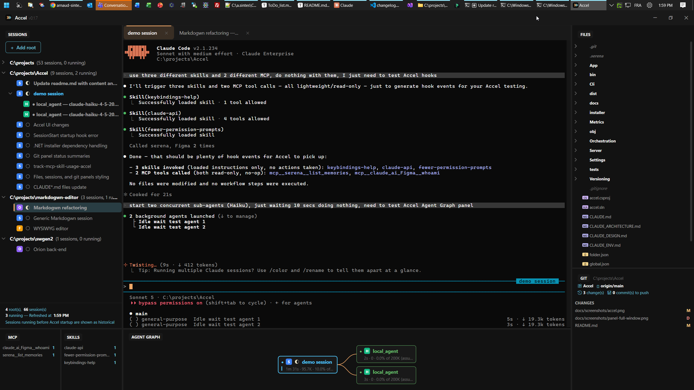
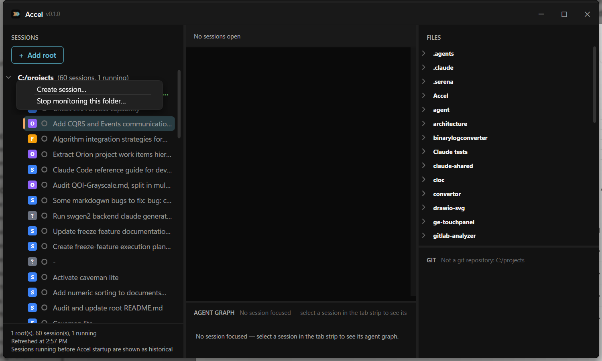
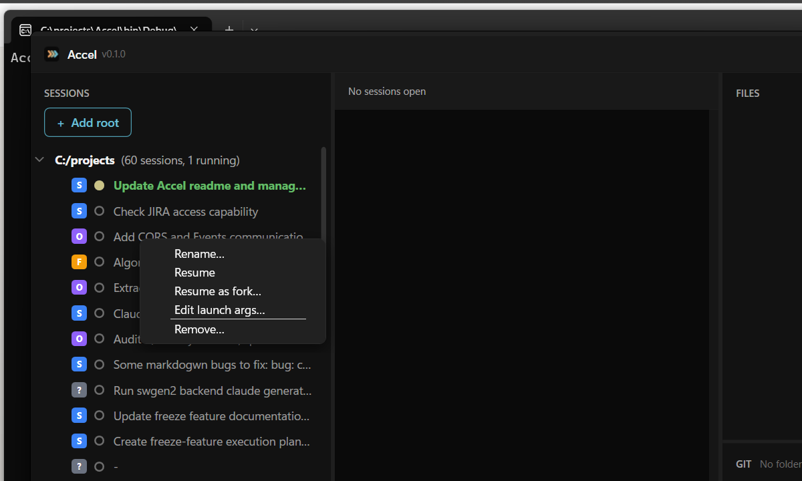
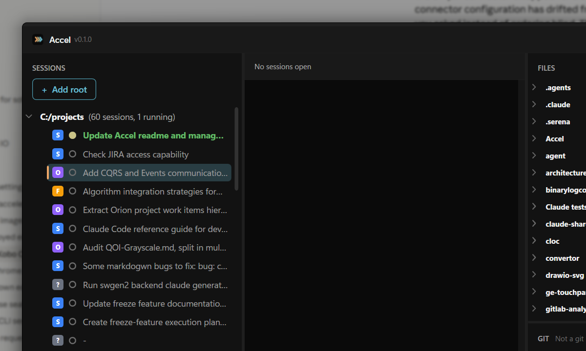
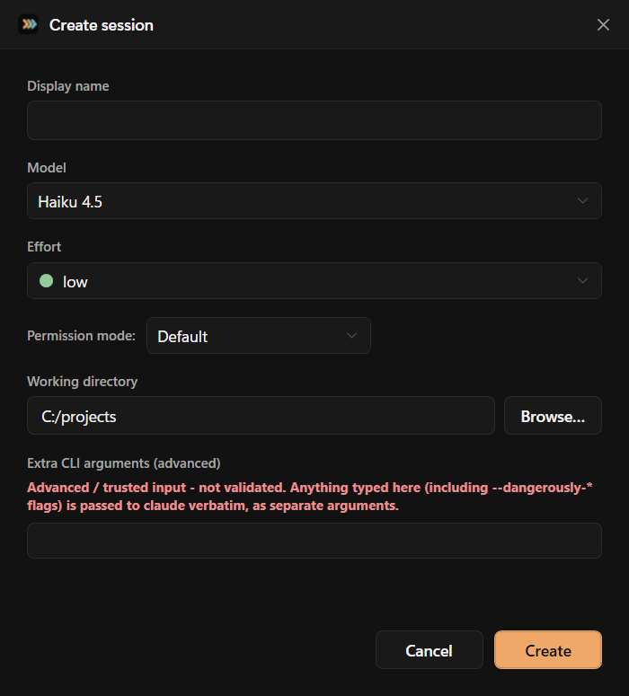
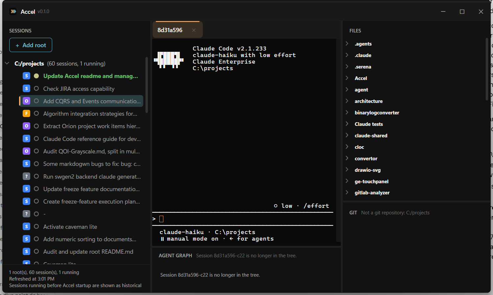

# Accel — Another Claude Code Ecosystem Layer



## What is Accel?

Native Windows C# tool that monitors Claude Code local session activity. Running `accel` with no arguments does everything in one combined process: it auto-installs itself into Claude Code hooks (`%USERPROFILE%\.claude\settings.json`) so Claude Code events are forwarded to Accel by self-invoking `accel.exe notify` (no `curl.exe` involved), starts a local, non-HTTPS HTTP server (default port **40010**, overridable via `--port`) to receive them in-process, and opens a WPF monitor window showing the configured root folders → Claude Code sessions → running sub-agents, plus a file tree, `git status`, MCP-tool/Skill usage, a PTY terminal with tabs, and an agent graph — refreshing live as events arrive (no polling).

## Building

### Requirements

- .NET 8 SDK (pinned to 8.0.424 via `global.json` — this avoids a broken workload-manifest resolver in newer versions)
- Windows 10 1809+ or Windows 11 (for the ConPTY pseudoconsole API used to host PTY sessions) plus the WebView2 Evergreen runtime (usually preinstalled; needed by the terminal panel — `accel doctor` checks for it)

### Build

```bash
dotnet build accel.sln
```

This builds the main `accel` project and the `accel.Tests` project (xUnit, 977 tests).

## Publishing

Publish as a self-contained, single-file Windows x64 executable:

```bash
dotnet publish accel.csproj -r win-x64 -c Release
```

**Output:** `bin/Release/net8.0-windows/win-x64/publish/accel.exe` (~179 MB)

Alternatively, run the included `publish.ps1`:

```powershell
.\publish.ps1
```

The exe requires no .NET runtime on the target machine — it includes everything needed to run.

## CLI Surface

- **`accel`** (default, no arguments) — Installs hooks into settings.json (best-effort — a refusal is printed but never aborts startup), starts the event server in-process, and opens the WPF monitor window, all in one process. Close the window to shut everything down cleanly.
- **`accel --port <n>`** — Same as above, but bind the server (and register hooks) on a different port than the default 40010.
- **`accel --verbose`** — Same as the default start, but also prints the diagnostic console output that a normal launch suppresses (per-event lifecycle lines, the full hook-install summary).
- **`accel --uninstall`** — Remove all Accel-registered hooks from settings.json and restore any pre-existing `statusLine`/`subagentStatusLine` settings, then exit immediately (no server/UI started).
- **`accel doctor`** — Short-lived, UI-less pre-flight diagnostic. Checks that `claude` resolves to a native executable (not an npm-style `.cmd`/`.bat`/`.ps1` shim) and that the WebView2 Evergreen runtime is installed (needed by the terminal panel). Prints `[OK]`/`[FAIL]` per check and exits 1 if anything failed.
- **`accel notify --port <n> --route <path> -H "X-Accel-Hook: <Event>"`** — **Internal verb, invoked by Claude Code itself as a short-lived child process** (this is what the four installed hooks actually run instead of `curl.exe`). Reads the hook's JSON payload from stdin, POSTs it to `http://127.0.0.1:<port><path>`, and always exits 0 having printed nothing — a connection refusal (Accel not running yet) is swallowed silently rather than surfacing as a hook error.
- **`accel statusline --port <n>`** — **Internal verb, invoked by Claude Code itself as a short-lived child process.** Reads the statusline payload from stdin, posts it to the server, and re-prints the chained original status line. Always exits 0.
- **`accel subagent-statusline --port <n>`** — **Internal verb, invoked by Claude Code itself as a short-lived child process.** Reads the subagent status array from stdin and posts it to the server without printing.

No other user-facing verbs are recognized (there is no separate `run`/`install`/`ui`/`status`/`sessions` anymore). A handful of raw-string-matched dev-only smoke/stress-test verbs also exist (`pty-smoke-test`, `pty-session-smoke-test`, `pty-registry-stress-test`, `pty-shutdown-orphan-test`, `terminal-e2e-smoke-test`, `tabs-e2e-smoke-test`) — not part of the documented surface, see `CLAUDE_ARCHITECTURE.md`.

## How It Works

1. **Hook Registration:** On startup, Accel reads `%USERPROFILE%\.claude\settings.json` and registers itself into four event hooks (`SessionStart`, `SessionEnd`, `SubagentStart`, `SubagentStop`) and two status-line commands (`statusLine`, `subagentStatusLine`).

2. **Event Forwarding:** Claude Code fires these hooks at the appropriate times, and each hook runs `accel.exe notify --port <n> --route <path> -H "X-Accel-Hook: <Event>"` — Accel notifying itself rather than shelling out to `curl.exe` — which POSTs the event payload as JSON to Accel's HTTP server and always exits 0, even if Accel isn't running yet.

3. **Status Line:** Accel installs itself as the `statusLine` command — when Claude Code requests a status-line update, Accel receives the payload on stdin, posts it to the server for metrics collection, and then re-invokes any pre-existing status-line command (or a default fallback) so the status bar continues to render normally.

4. **Server:** The embedded HTTP server binds to `127.0.0.1:40010` (by default), receives POST requests to `/events/*` routes, parses the JSON event payloads, prints them to the terminal, and maintains an in-memory snapshot of active sessions and subagents.

5. **Querying:** The server's HTTP GET routes (below) can still be queried externally for scripting or monitoring purposes.

6. **Root Folders Configuration:** Accel looks for a root-folders config file in this order (first one that *exists on disk* wins — even if it then fails to parse, later candidates are not tried):
   - `%USERPROFILE%\.claude\accel-folders.json` (preferred/durable location, colocated with other Accel state)
   - `<directory of the running executable>\folder.json` (for portable deployments)
   - `<current working directory>\folder.json` (for development)

   Two on-disk shapes are supported:
   - **v1 (legacy)** — a flat JSON array of absolute folder paths:
     ```json
     ["C:/projects"]
     ```
   - **v2** — a JSON object that also carries a sparse per-session override map, keyed by session id:
     ```json
     {
       "version": 2,
       "roots": ["C:/projects"],
       "sessions": {
         "<session-id>": { "displayName": "My session", "pinned": true, "hidden": false, "lastOpenedUtc": "2026-01-01T00:00:00Z" }
       }
     }
     ```
     Adding/removing a root folder from the UI ("Add root folder…" / "Stop monitoring this folder…") reads and rewrites this same file (always upgrading it to v2 on save, via `RootFoldersConfig.Save`) — it is **not** a separate settings file. The `sessions` map is the storage format reserved for per-session overrides (rename, pin, hide); as of this writing no context-menu action other than root add/remove writes to it yet, so it stays empty in practice until that wiring lands. This file is unrelated to Claude Code's own `%USERPROFILE%\.claude\settings.json` (the hooks file `InstallCommand`/`SettingsMerger` manage) — the two must not be confused or merged.

   If no config file is found or it is malformed, Accel treats it as an empty config (no roots, no session overrides).

7. **UI Window:** Running `accel` opens a WPF monitor window in the same process as the server, displaying the configured root folders, all Claude Code sessions under those folders (both active and historical), and for active sessions, the currently running sub-agents — see [UI Panels](#ui-panels) below for a tour of each panel. It refreshes on genuine push signals (a hook/statusline POST arriving, or a change detected on disk) rather than a polling timer, debounced by ~250ms so a burst of activity collapses into a single refresh.

8. **API Endpoints:** The server exposes two additional HTTP GET routes (used by the UI and queryable externally):
   - `GET /roots` — Returns the configured root folder paths as a JSON array.
   - `GET /roots/tree` — Returns the full hierarchical tree of roots, sessions, and running sub-agents with metadata (model, effort, context usage, etc.).

## UI Panels

The monitor window is split into five panels (`A`–`E`), each bound to its own view model — see `CLAUDE_ARCHITECTURE.md` §2.7 for the implementation details. Screenshots below are real captures of a running window (`docs/screenshots/panel-*.png`).

```
+------------------+---------------------------------------+------------------+
| Panel A (top 3/4)| Panel C (tab strip)                   | Panel B          |
| Roots / sessions | Panel D (terminal, WebView2+xterm.js) | Files (top)      |
| / sub-agents     |                                       | Git status (bot) |
| (tree, left)     +---------------------------------------+                  |
| Panel A (bottom  | Panel E (agent graph, bottom)         |                  |
| 1/4): MCP/Skills |                                       |                  |
+------------------+---------------------------------------+------------------+
```

- **Panel A — Roots / Sessions / Sub-agents** (`RootsPanelViewModel`, left column, top 3/4): a tree of the configured root folders (sorted alphabetically), every Claude Code session found under them (live or historical), and, for a live session, its currently running sub-agents. Right-clicking a row opens a context menu whose items are gated by the row's kind:
  - **On a root folder:** *Create session…* (opens the "Create session" dialog with that folder pre-filled as the working directory), *Stop monitoring this folder…* (removes the root from `folder.json`/`accel-folders.json` — see [Root Folders Configuration](#how-it-works) above).

    

  - **On a session:** *Rename…*, *Resume*, *Resume as fork…*, *Edit launch args…*, *Remove…* (only enabled for a session that's currently open in a tab; see the same section above for what does/doesn't currently persist to disk).

    

- **Panel A — MCP / Skills usage** (`McpSkillsPanelViewModel`, left column, bottom 1/4): two flat, most-used-first lists of the focused session's MCP-tool and Skill hit counts. Accel only counts `PostToolUse` hits observed while it was running, so a historical (not-currently-open) session always shows empty lists here.

- **Panel B — Files / Git** (right column, top/bottom split): a read-only file tree for whichever folder is currently focused (top, with per-file-type icons), and a flat `git status` list for that same folder grouped into "Staged Changes"/"Changes" (bottom, VS Code Source Control style). Expand/collapse only — no file-open, no stage/commit/push actions yet.

  

- **"Create session…" dialog**: opened from Panel A's root context menu. Lets you set a display name, model, effort, permission mode, working directory, and (advanced/unvalidated) extra CLI arguments before spawning the PTY session. Effort is a 5-tier scale (low/medium/high/xhigh/max) gated per model family — Haiku has no reasoning-effort knob at all, so the control hides/disables itself rather than offering a setting the CLI would reject.

  

- **Panel C — Tab Strip** (`TabsViewModel`, top of the center column) and **Panel D — Terminal** (`TerminalView`, below the tab strip): one tab per open PTY session; double-clicking a tab renames it; selecting a tab focuses it across the whole window (Panel A highlights the matching session, Panel D reattaches its terminal — a single shared WebView2/xterm.js instance — to it over a `ws://…/pty/{tabId}` connection, Panel E rebuilds around it). The screenshot below shows a freshly created `claude-haiku` session right after launch.

  

- **Panel E — Agent Graph** (`AgentGraphViewModel`, bottom of the center column): a left-to-right node graph of the focused session's currently running sub-agents (parent first, bezier connectors), each card showing model badge and an `EffortBarsControl` radial gauge for its effort level (five tiers: low/medium/high/xhigh/max). Visible but empty ("no session focused" / "no longer in the tree") in the screenshot above, since that session had no focus and no sub-agents running yet — a genuine sub-agent graph capture is still pending a session that spawns Task sub-agents while under the monitor.

## Example Usage

```bash
# Install hooks, start the server, and open the monitor window - all in one process
accel

# Same, but on a different port
accel --port 41000

# Remove all Accel hooks and exit
accel --uninstall

# Run pre-flight diagnostics (claude resolution, WebView2 runtime)
accel doctor
```

## Testing

```bash
dotnet test Accel.sln
```

Runs 977 unit tests covering settings merge/diff, hook registration, state management, CLI parsing, session/folder tree enumeration, the file/git/MCP-Skills panels, and per-model effort gating.
